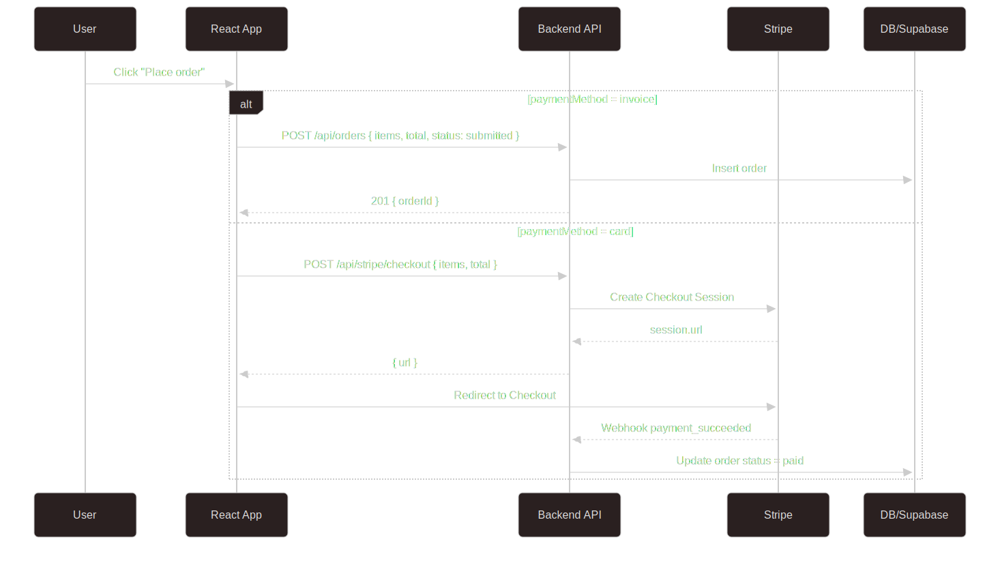

# ProcesoryPanel — Client Panel (React + Vite + Supabase)

A modern React + TypeScript app with an authenticated client panel, checkout flow (Stripe or invoice), and a polished UI built with Tailwind CSS. It includes a home page, stages overview, and a client dashboard with sections like Cart, Projects, Account, Activity, and Pipeline.

## Tech Stack

- React 19 + TypeScript 5.9 (Vite 7)
- React Router 7
- Tailwind CSS 3 + PostCSS + Autoprefixer
- Supabase (authentication)
- Optional: Stripe (card payments via server endpoint)
- ESLint (flat config) with React hooks/refresh plugins

## **Features**

- Authentication: sign-in/sign-up with Supabase; protected routes
- Client dashboard: Cart, Projects, Account, Activity, Pipeline
- Checkout: choose card (Stripe) or invoice/bank transfer
- Responsive UI with Tailwind and glass-style panels
- Type-safe code with TS, clean project structure

## Project Structure

- src/App.tsx — App shell
- src/main.tsx — App entry point
- src/index.css — Tailwind base/styles
- src/app/router.tsx — Route definitions
- src/features/auth/ — Auth context, provider, protected route, pages
- src/features/client/ — Client panel pages, helpers, and components
- src/features/stages/ — Stages page and data
- src/lib/supabase.ts — Supabase client setup

## Architecture Notes

- Route tree lives in `src/app/router.tsx`; auth-protected routes wrap pages via `ProtectedRoute`.
- Feature folders (`src/features/*`) own their UI and related data; shared UI lives in `src/components`.
- Static dashboard data is centralized in `src/features/client/panelData.ts` and passed into UI components.
- `src/lib` holds external integrations (Supabase), keeping API clients out of UI code.

## Getting Started

### Prerequisites

- Node.js 18+ (recommended 20+)
- npm, pnpm, or yarn
- Supabase project (for auth) and optional backend for orders/Stripe

### Environment setup

Create a `.env` file (copy from `.env.example`) and fill in your Supabase keys:

```
VITE_SUPABASE_URL=your_supabase_url
VITE_SUPABASE_ANON_KEY=your_supabase_anon_key
```

### Installation

```bash
# install dependencies
npm install
# start dev server
npm run dev
# build for production
npm run build
# preview production build
npm run preview
# lint
npm run lint
```


